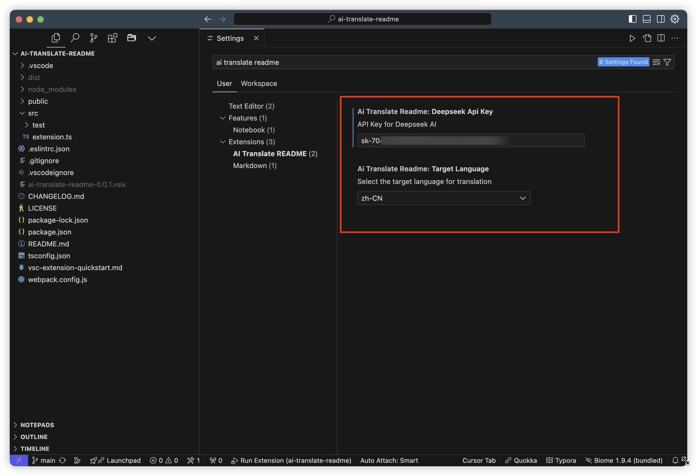
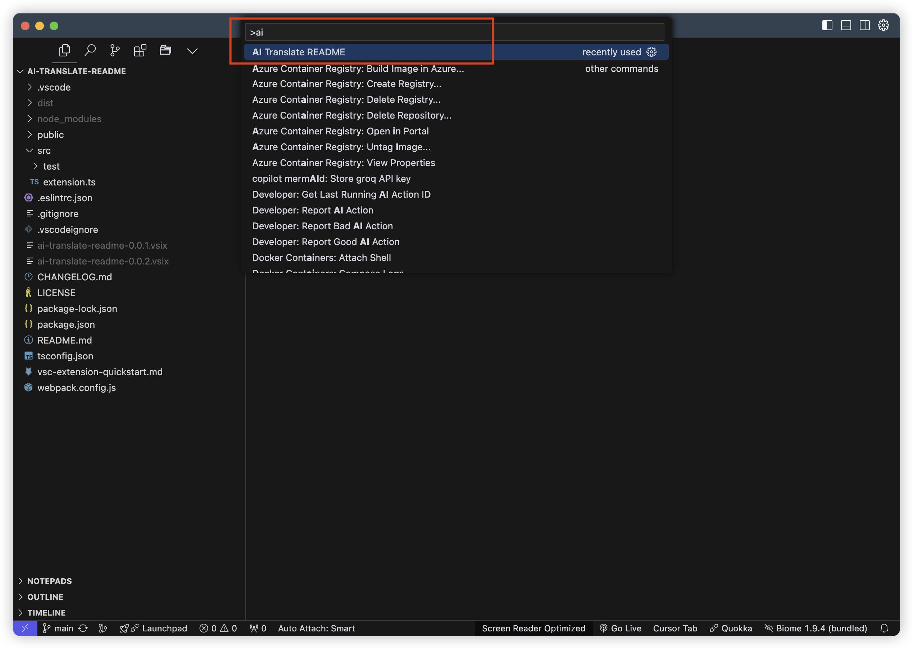
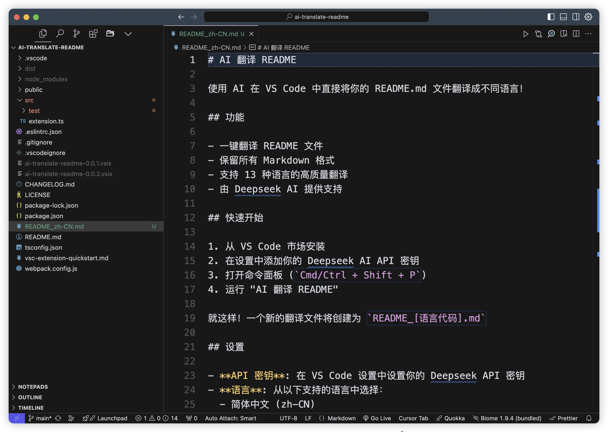

<h4 align="right"><strong>English</strong> | <a href="https://github.com/Penggeor/ai-translate-readme/blob/main/README_zh-CN.md">简体中文</a>

# AI 翻译 README

使用 AI 在 VS Code 中一键翻译你的 README.md 文件！

## 功能

- 一键翻译 README 文件
- 保留所有 Markdown 格式
- 支持 13 种语言的高质量翻译
- 由 Deepseek AI 提供支持

## 快速开始

1. 从 VS Code 市场安装
2. 在设置中添加你的 Deepseek AI API 密钥

3. 打开命令面板 (`Cmd/Ctrl + Shift + P`)

4. 运行 "AI Translate README"

搞定！一个新的翻译文件将会被创建为 `README_[语言代码].md`

## 设置

- **API 密钥**: 在 VS Code 设置中设置你的 Deepseek API 密钥
- **语言**: 从以下支持的语言中选择：
  - 简体中文 (zh-CN)
  - 繁體中文 (zh-TW)
  - 日本語 (ja)
  - 한국어 (ko)
  - Français (fr)
  - Deutsch (de)
  - Español (es)
  - Italiano (it)
  - Português (pt)
  - Русский (ru)
  - العربية (ar)
  - हिन्दी (hi)
  - Tiếng Việt (vi)

## 要求

- VS Code 1.69.0 或更高版本
- Deepseek AI API 密钥

## 贡献

欢迎贡献！随时提交 Pull Request。

## 许可证

MIT 许可证 - 详情请参阅 LICENSE 文件。